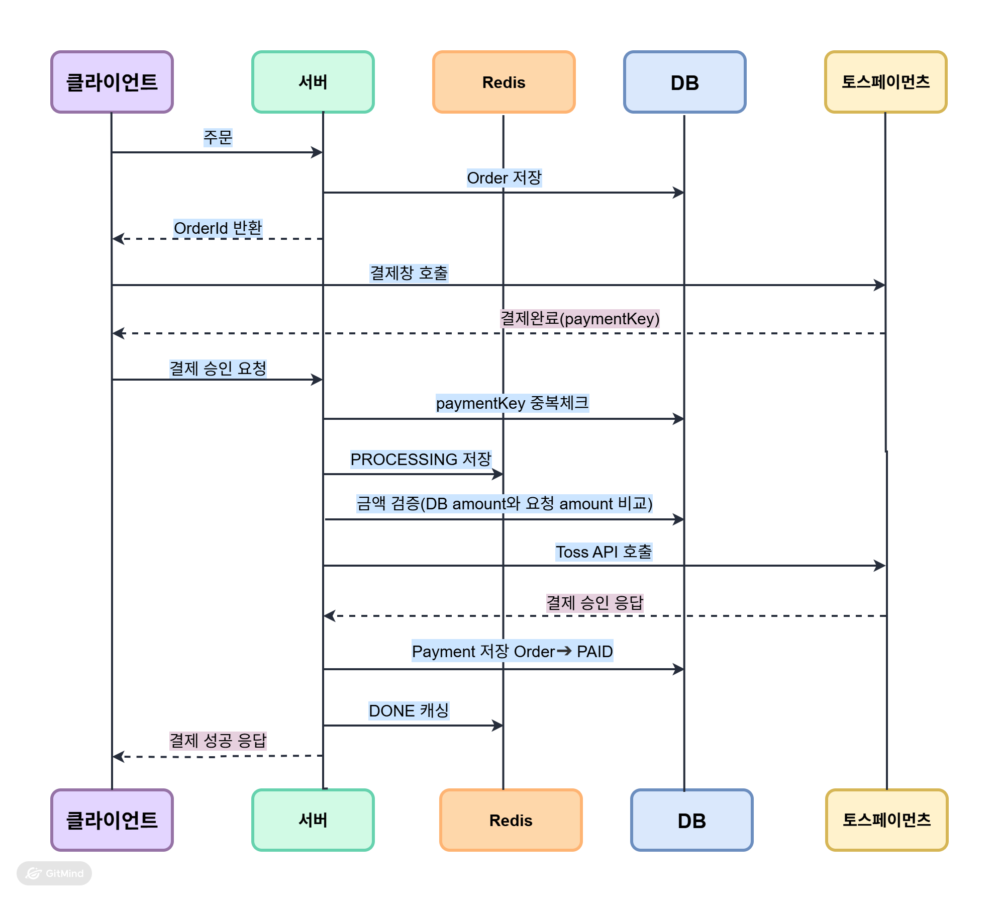
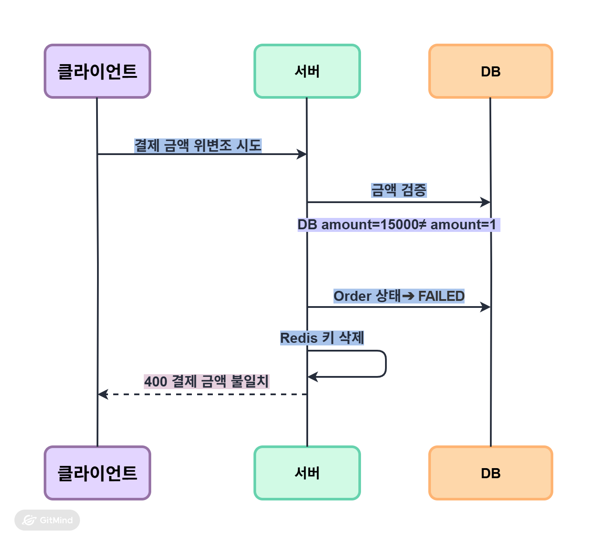
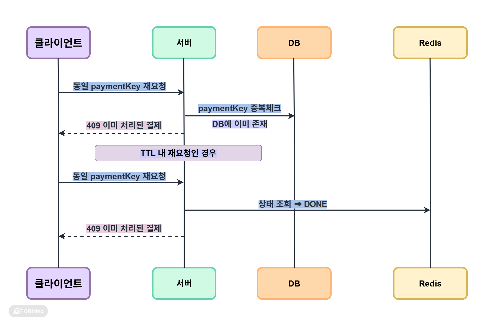

## ShopPay
> Toss Payments Sandbox 기반 결제 검증 프로젝트: 결제 위변조 방어 중복 결제 차단 실패시 복구 흐름 설계
---
## 기술 스택
Spring Boot, Java , MySQL, Redis, Docker

## 핵심 구현

### 1. 정상 결제 흐름
> 주문 생성 → Toss 결제창 → 서버 금액 검증 → confirm API 호출 → DB 저장까지 전 과정이 정상 처리됩니다.

### 2. 금액 위변조 차단
> 클라이언트가 결제 금액을 15,000원 → 1원으로 위변조해 요청하면, 서버에서 DB 저장 금액과 비교해 불일치를 감지하고 400을 반환합니다.

### 3. 멱등성 처리(중복 결제 차단)

**2단계 방어 구조:**

#### Redis 선점 (TTL 내 실시간 차단)

> 동일한 paymentKey로 재요청 시 TTL 내에는 Redis DONE 상태로 즉시 차단하고 TTL 만료 후에는 DB payment_key 중복 체크로 영구 차단해 이중 결제를 방지합니다.

- TTL: 3분(Toss API 통상 응답시간 30~60초 기준 여유분 적용)

#### DB UNIQUE 제약 (TTL 만료 후 영구 차단)
>TTL 만료 후 동일 `payment_key` 재요청 시 DB `existsByPaymentKey` 체크로 최종 방어

---
## 부하테스트 결과

### 시나리오 1: 동시 중복 요청 차단 검증

| 항목 | 결과 |
|------|------|
| 동시 요청 수 | 동일 paymentKey 100건 |
| DB insert | 1건 |
| 중복 결제 | 0건 |
| 나머지 99건 | 409 즉시 반환 |

### 시나리오 2: 정상 동시 처리 검증
 
| 항목 | 결과 |
|------|------|
| 동시 요청 수 | 각각 다른 paymentKey 100건 |
| Error % | 0% |
| 중복 결제 | 0건 |
| TPS | 13.8/sec |
| 평균 응답시간 | 6,499ms (로컬 환경, Mock 적용) |
| P95 | 7,184ms |
 
> Mock 환경: Toss Sandbox rate limit 고려해 외부 API 호출 제외 내부 로직(Redis 선점 + DB insert) 단독 측정

---
## 트러블슈팅
 
### 결제 확정 후 DB 미저장 문제 — 네트워크 단절 시 결제 유실
 
**문제:**
개발 중 네트워크 단절 상황에서 Toss API 호출 후 응답을 받지 못한 채 연결이 끊어짐

결제가 실제로 승인됐는지 알 수 없는 상태에서 DB에 아무것도 남지 않아 해당 결제 건 추적 불가
 
**원인:**
Toss API 호출 실패를 단순 예외로 처리해 FAILED로 전환하고 종료

타임아웃/네트워크 단절(성공 여부 불명확)과 명확한 실패 응답을 동일하게 처리한 구조
 
**해결:**
예외 유형을 분리해 UNKNOWN 상태 도입
 
- `ResourceAccessException` (타임아웃/네트워크 단절) → UNKNOWN 전환 후 스케줄러 재시도
- `TossPaymentException` (Toss 명확한 실패 응답) → 즉시 FAILED 처리
- UNKNOWN 상태는 스케줄러가 감지해 RetryService로 위임하고 TTL 3분 × 최대 3회 재시도 후 최종 FAILED 처리
  
**결과:**

네트워크 단절로 인한 결제 유실 없이 재시도 가능한 구조 확보

명확한 실패와 응답 유실을 분리해 불필요한 재시도 차단

